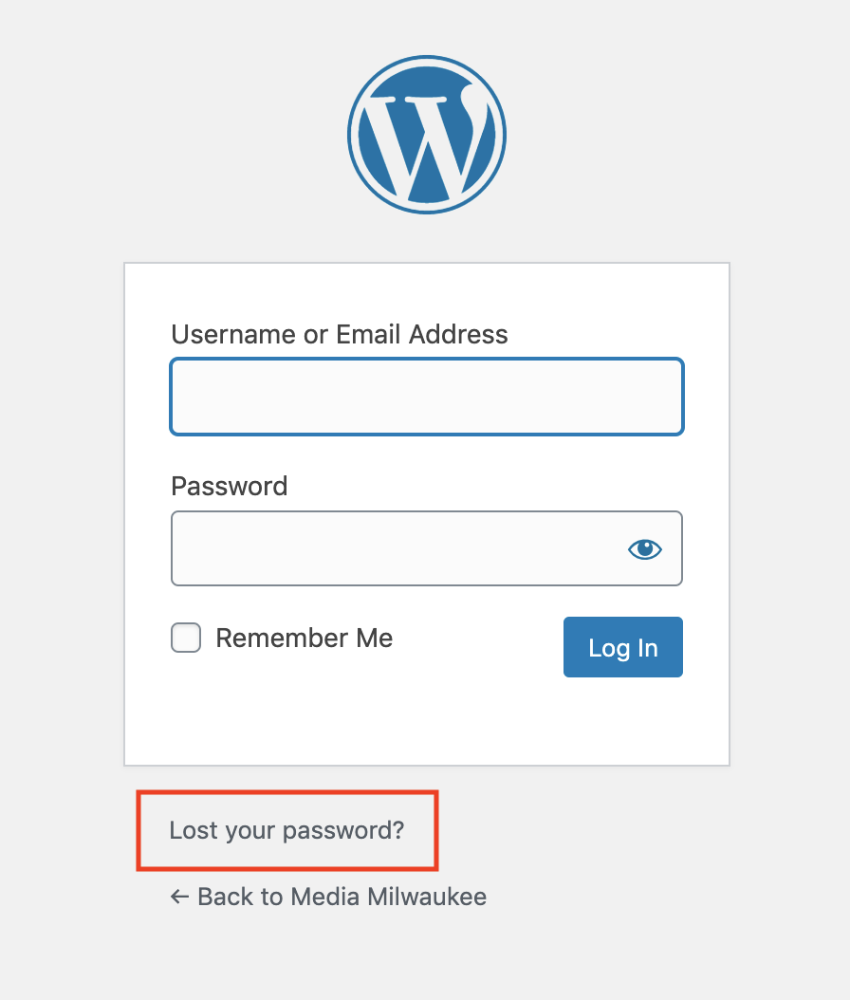

# Resetting Your Password

1. Go to the [Media Milwaukee log in screen](logging-in-to-media-milwaukee.md).
2. Click the **Lost your password?** link.
3. Enter your UWM email address and click **Get New Password**.
4. Go to your UWM email account and check your **Inbox** for a new email from WordPress. (**Important**: You may need to check your **Junk** and **Clutter** folders for the password reset email.)
5. To reset your password, click the link provided in the email.
6. WordPress will provide you with a new password. Delete this password and enter a new one. **Note**: You will need to create a strong password.
7. After your password is reset, click the **Log in** link to log into your site with your new password.

## Common login problems

* Attempting to log into WordPress.com instead of [Media Milwaukee log in screen](logging-in-to-media-milwaukee.md).
* Attempting to log into WordPress.org instead of [Media Milwaukee log in screen](logging-in-to-media-milwaukee.md).
