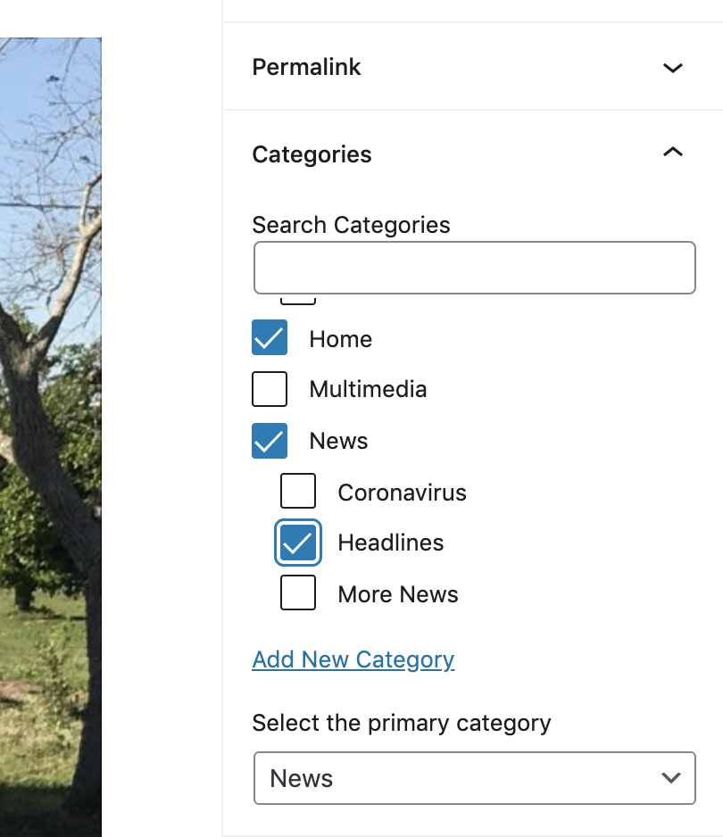

# Assigning Categories and Adding Story to Home Page

1. In a post, make sure the **Document** tab is selected (on right.)
2. Scroll down to the **Categories** area (on right.)
3. Select the post's primary category (**News**, **Opinion**, **Sports**, etc.)&#x20;
4. If you’d like the post to appear on the home page, select the **Home** category (in addition to the post's primary category.)
5. If you’d like the story to appear in **Top Stories**, **Headlines**, **Multimedia** or **More News** (on the home page) select the corresponding category.
6. If you’d like the story to appear at the top of a home page category area (area with featured image), make sure the story has a featured image (see [Setting a Featured Image](../working-with-text-and-links/setting-a-featured-image.md).) Then select **Stick to the top of blog** (top of **Documents** area.)
7. When finished, click **Publish** or **Update**.

