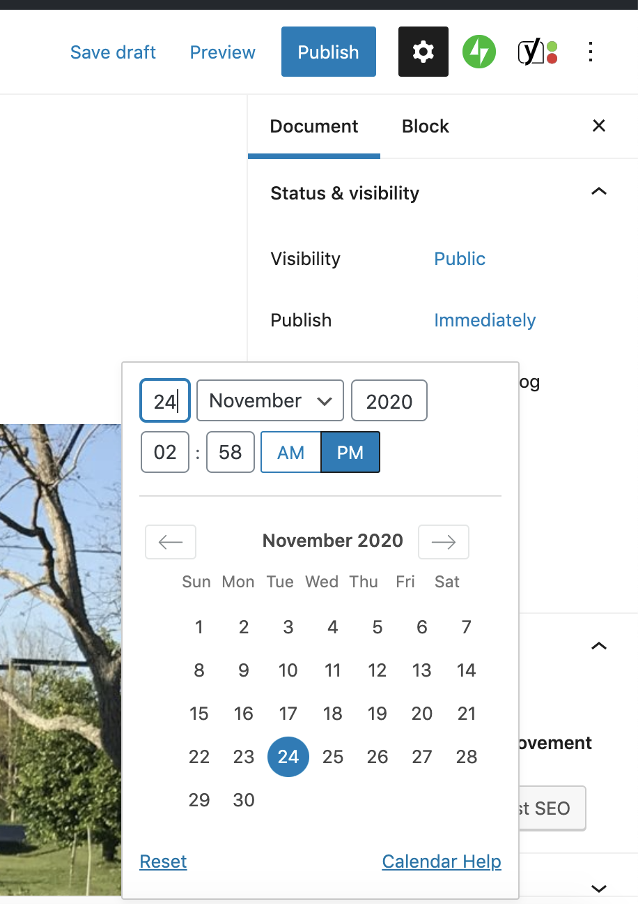

# Changing Publication Date and Time

### Changing date and time of new post

1. Make sure the **Document** tab is select in the **Setting** panel (on right.)
2. In the **Publish** area, click **Immediately**.&#x20;
3. In the **calendar** interface, select a new date and time.&#x20;
4. When finished, click **Publish**.

### Changing date and time of existing post

1. Make sure the **Document** tab is select in the **Setting** panel (on right.)
2. In the **Publish** area, click the post's publication date and time.&#x20;
3. In the **calendar** interface, select a new date and time.&#x20;
4. When finished, click **Publish**.

