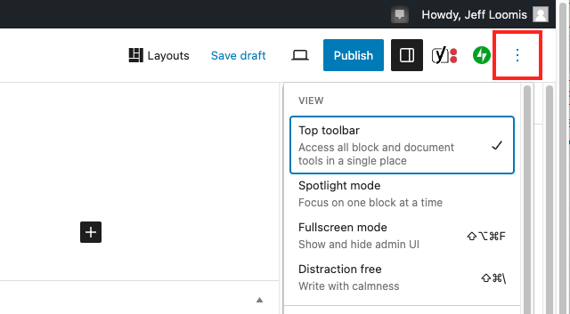

# Panels in Editor Are Missing

If, while creating a **Post**, you notice that panels such as the **Dashboard** (on left) or **Settings** panel (on right) are missing, you may have accidentally selected a **View** that hides these options.&#x20;

1. If necessary, hover your mouse pointer in the upper-right corner of the **Editor** area to display the **Options** button (three vertical dots.)&#x20;
2. Click the **Options** button (three vertical dots) to display the **View** options.
3. Click on a **View** option to activate it or deactivate it. A checkmark will appear next to an activated **View**.&#x20;
4. To display all panels in the **Editor**, make sure **Top toolbar** is activated (checkmark) and the other **View** options are deactivated (no checkmark.) See image below.&#x20;

<figure><figcaption>
Top toolbar is activate while other View options are not active.
</figcaption></figure>
