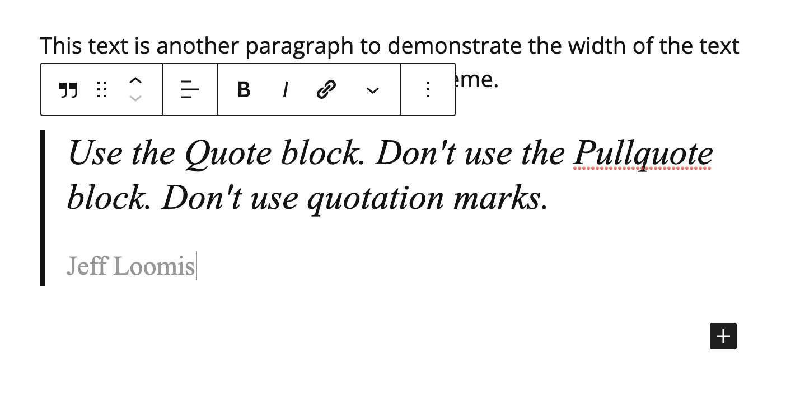

# Adding a Blockquote

A **blockquote** is a stylized quote featuring text not used elsewhere in the post.&#x20;

When you create a **blockquote** it is not necessary to put quotation marks around the quote.

1. In a post, click the **Add block** button (plus sign) and select **Quote**. **Note**: Do not select **Pullquote**.&#x20;
2. In the **Quote** block, write the quote (without quotation marks) and add the citation (name of person who said the quote.)
3. When finished, click **Save draft**.&#x20;

