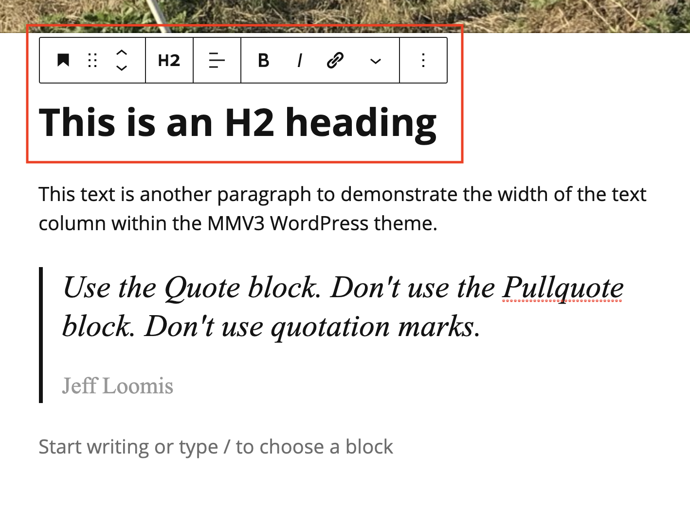

# Adding a Heading

Headings allow you to organize a post into different sections. When adding a heading to a post in Media Milwaukee, always choose **Heading 2 (H2.)**&#x20;

1. In a post, click the **Add block** (plus sign) button and select **Heading**.
2. Click within the **Heading** block and make sure **H2** is selected.&#x20;
3. Add your text to the **Heading** block.&#x20;
4. Click **Save draft** when finished.&#x20;

