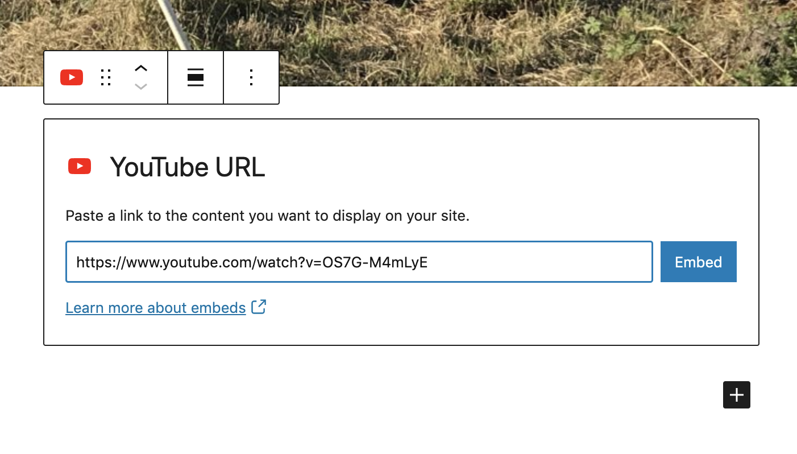

# Adding a Video

### Adding a video to a post

Before adding a video to a story, you'll need to upload it to YouTube or Vimeo. Then, you'll copy and paste the video's URL into your story. Never upload a video file directly to Media Milwaukee.&#x20;

1. If you haven't already done so, export your video and upload it to YouTube or Vimeo.
2. Copy the URL of the video.
3. In a post, click the **Add block** button. Select YouTube or Vimeo.
4. Past the video's URL in the **YouTube** or **Vimeo** block. Click the **Embed** button.
5. If necessary, [align and resize the video](aligning-and-resizing-a-video.md).&#x20;

