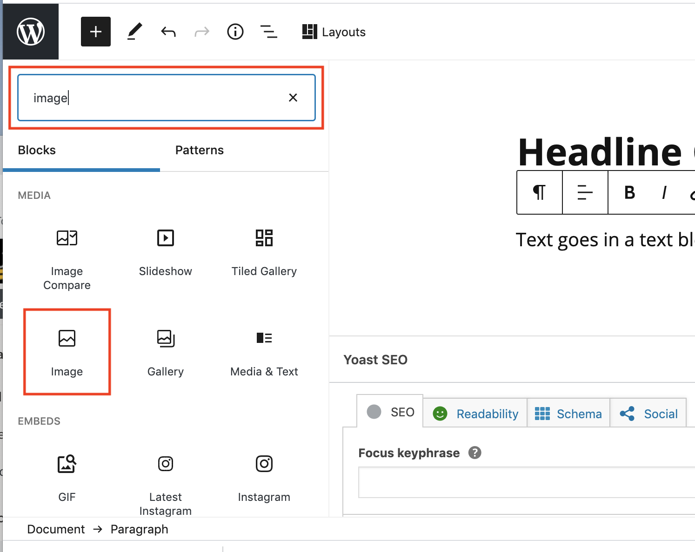
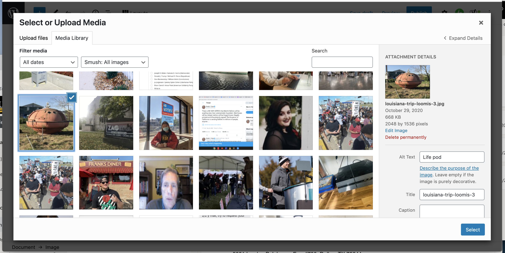

# Adding an Image

### Renaming images prior to upload

Renaming an image before uploading it to Media Milwaukee makes it easier to find in the site's **Media Library**. Renaming images also lets other users and instructors know who took the photo.&#x20;

A good approach to follow when naming image files is to use this approach: subject-your-last-name.jpg. If you have multiple images related to the same subject, you can add a number (-1, -2, -3, etc.) to the end of the file name as well. **Note**: Always maintain the file extension (.jpg, .png, etc.)&#x20;

A properly renamed image might look like this: election-day-loomis-3.jpg.

### Adding an image directly to a post

1. Rename images on your computer (see above.)
2. In a post, click the **Add block** button (plus sign.) Select the **Image** block. (**Note**: Do not select **Image Compare** or **Slideshow**.)
3. To upload an image, click the **Upload** button. Navigate to and select the image on your computer.
4. To select an image from the **Media Library**, click the **Media Library** button. Select the image you'd like to use and click the **Select** button.&#x20;
5. If necessary, [align and resize the image](aligning-and-resizing-an-image.md).&#x20;
6. Add a [caption and alt text](adding-a-caption-and-alt-text-to-an-image-mp3-or-video.md) to the image.

### Adding images to the Media Library

1. Rename images on your computer (see above.)
2. In the Media Milwaukee **Dashboard**, click the **Media** button (on left.)&#x20;
3. Click the **Add New** button.&#x20;
4. Click and drag image files from your computer into the **Drop files to upload** area. **Note**: Don't drag and drop more than 10 image files at a time. The maximum upload size is 64 MB.
5. The images will appear in the **Media Library**. You may now add the images directly to a story (see above.)&#x20;
6. If necessary, [align and resize the image](aligning-and-resizing-an-image.md).&#x20;
7. Add a [caption and alt text](adding-a-caption-and-alt-text-to-an-image-mp3-or-video.md) to the image.

&#x20;

