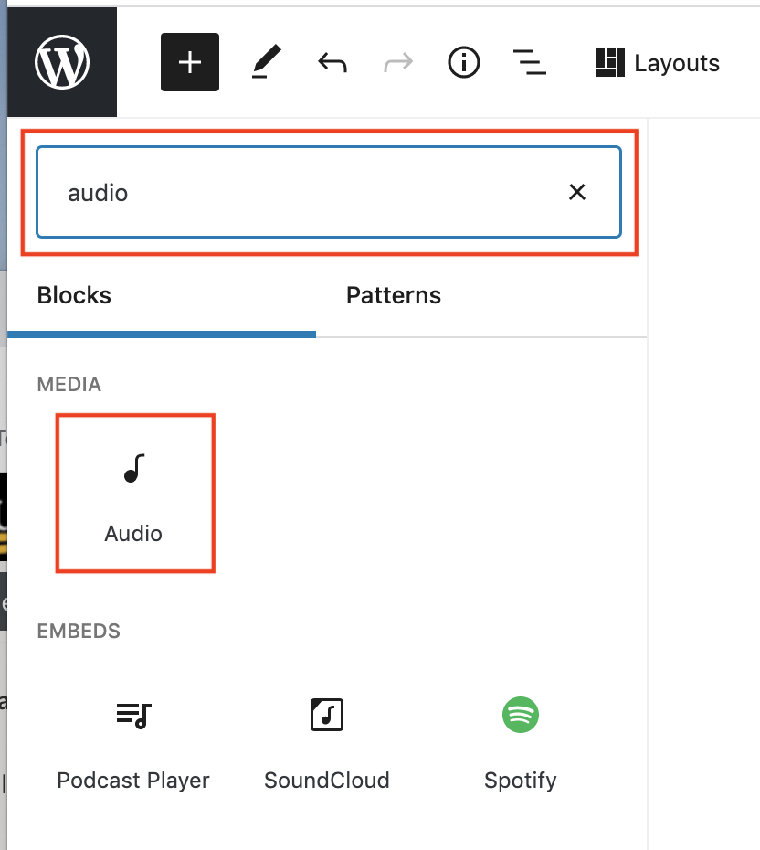

# Adding an MP3

### Renaming MP3 prior to upload

Renaming an MP3 before uploading it to Media Milwaukee makes it easier to find in the site's Media Library. Renaming an MP3 also lets other users and instructors know who created it.&#x20;

A good approach to follow when naming MP3 files is to use this approach: subject-your-last-name.jpg. If you have multiple MP3 files related to the same subject, you can add a number (-1, -2, -3, etc.) to the end of the file name as well. **Note**: Always maintain the file extension (.mp3.)&#x20;

A properly renamed image might look like this: election-day-loomis-3.mp3.

### Adding an MP3 directly to a story

1. Rename MP3 on your computer (see above.)
2. In a post, click the **Add block** button (plus sign.) Select the **Audio** block.
3. To upload an MP3, click the **Upload** button. Navigate to and select the MP3 on your computer.
4. To select an MP3 from the **Media Library**, click the **Media Library** button. Select the MP3 you'd like to use and click the **Select** button.&#x20;

### Adding MP3 files to the Media Library

1. Rename MP3 on your computer (see above.)
2. In the Media Milwaukee **Dashboard**, click the **Media** button (on left.)&#x20;
3. Click the **Add New** button.&#x20;
4. Click and drag the MP3 files from your computer into the **Drop files to upload** area. **Note**: The maximum upload size is 64 MB.
5. The MP3 files will appear in the **Media Library**. You may now add the MP3 files directly to a story (see above.)&#x20;

