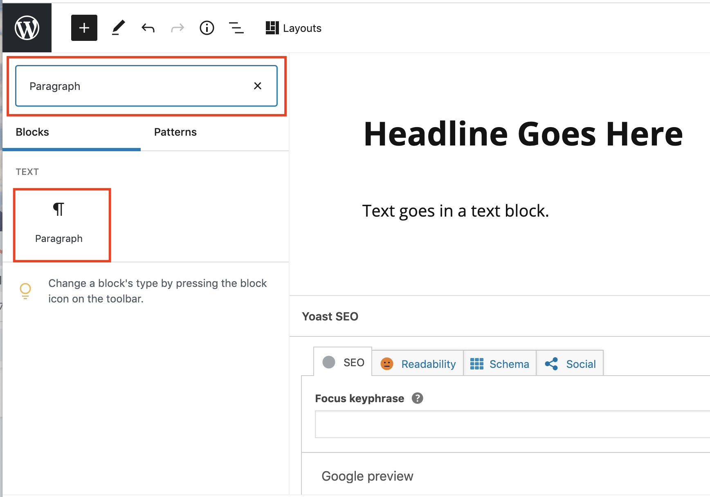

# Adding Text

### Manually enter text

1. Click within a **Paragraph** block and start typing.
2. Press **Return** or **Enter** (on keyboard) to create a new **Text** block.
3. To manually add a **Paragraph** block, click the **Add block** button (plus sign.) Select the **Paragraph** block. &#x20;

### Copy and paste text from Word or Google Docs

1. Select and copy the text in Word or Google Doc.
2. In WordPress, click within an empty **Text** block.
3. Press **Command** **Shift** **V** (Mac) or **Control** **Shift** **V** (PC) on keyboard to paste the text. This will paste the raw text and remove any formatting present in  the original document.&#x20;

