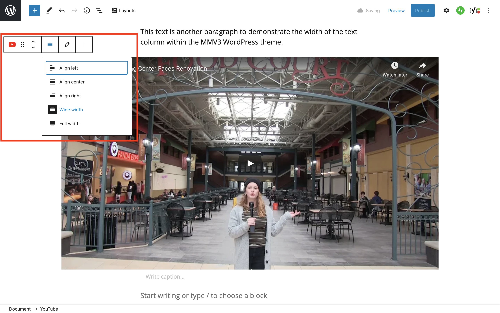

# Aligning and Resizing a Video

To change the size of a video in a post, use the alignment/ width options listed below.&#x20;

* The **no alignment** (default text column width.) The video will be the same width as the text column.
* The **Wide width** option will make the video slightly wider than the text column.
* **Note:** Do not use the **Full width** option for videos.&#x20;

1. To change image alignment, click the video in the post. In the toolbar that appears above the video, click the **Change alignment** button.
2. In the drop-down list of alignment options, select the alignment you’d like to use (see above for appropriate use case scenarios.)&#x20;
3. To deselect or turn off an alignment option, click it again (it will no longer appear highlighted/ selected. **Note**: The default option is **no alignment** (text column width.)

