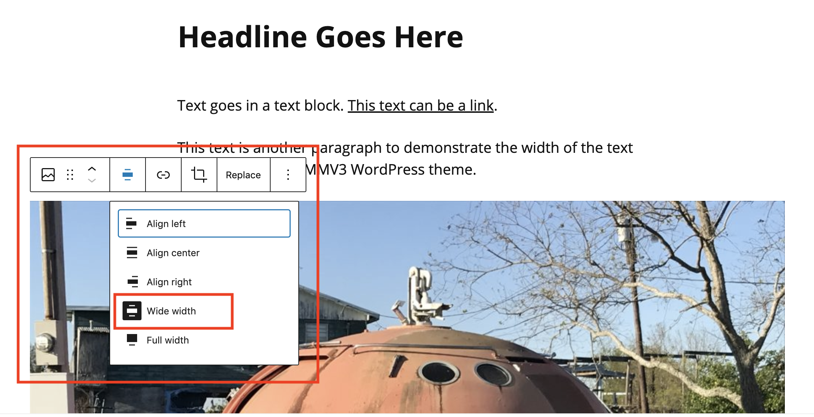

# Aligning and Resizing an Image

**Important**: Do not use the image settings in the **Documents** panel to change the size of an image. For example, the **Image size** drop-down options (in the **Documents** panel) should not be changed. The **Image dimensions** area (in the **Documents** panel) should not be changed. Also, do not click and drag the **image resizing handles** to resize an image within a story.

If your photos came from a modern camera or phone, there will be no reason to use the image options in the **Documents** panel. **Note**: This only applies to image options within the **Documents** panel. Instructions on the proper use of image alignment controls (**none**, **Wide** **width,** **Full width**) are detailed below.&#x20;

To change the size of an image in a post, use the alignment/ width options listed below.&#x20;

* The **no alignment** (default text column width) option should be used for portrait-oriented images.
* The **Wide width** option should be used on landscape-oriented images.
* **The Full width** option should only be used in long-form projects utilizing the **Advanced post template**.&#x20;

1. To change image alignment, click the image in the post. In the toolbar that appears above the image, click the **Change alignment** button.
2. In the drop-down list of alignment options, select the alignment you’d like to use (see above for appropriate use case scenarios.)&#x20;
3. To deselect or turn off an alignment option, click it again (it will no longer appear highlighted/ selected. **Note**: The default option is **no alignment** (text column width.)

