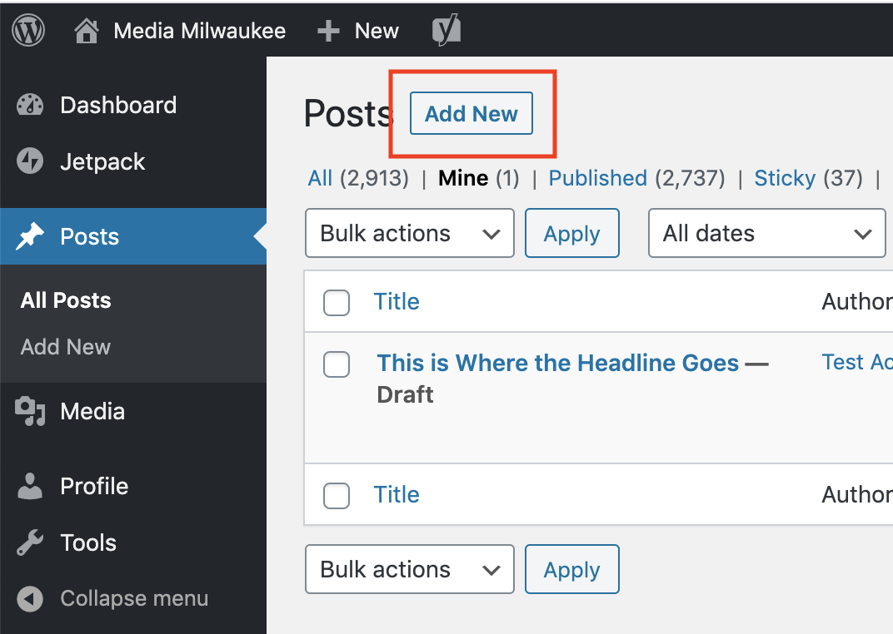

# Creating a Post

To add a story to Media Milwaukee, you'll need to create a post and submit it for review. Your post will not be public until your instructor or editor reviews and approves your content.

1. From the **Dashboard**, click **Posts** and select **Add New**.&#x20;
2. Enter a title for your post.
3. Add [text](adding-text.md), [images](adding-an-image.md), [MP3 files](adding-an-mp3.md), and [video embeds](adding-a-video.md) as needed.
4. Add a [featured image](setting-a-featured-image.md) if you have one available.&#x20;
5. Edit your URL, if necessary.&#x20;
6. To preview your post, click **Preview**. **Note**: This will open a new tab in your browser. Be sure to work with the original tab when making changes to your post.
7. When finished, click the **Publish** button and then select **Submit for Review**.&#x20;

