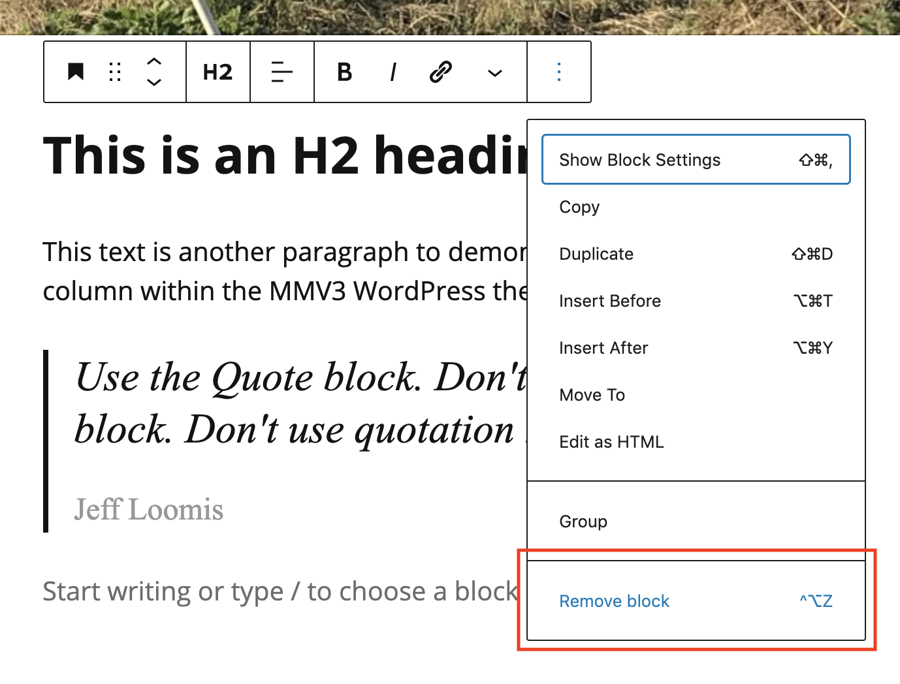

# Moving and Deleting Items in a Post

### Moving an item

1. Click a block in a post to select it.&#x20;
2. In the block's toolbar, click the **Move up** button or **Move down** button.
3. When finished, click **Save draft**.&#x20;

### Deleting an item

1. Click a block in a post to select it.&#x20;
2. In the block's toolbar, click the **More options** (three dots) button. In the fly-out menu, choose **Remove block**.
3. When finished, click **Save draft**.&#x20;

