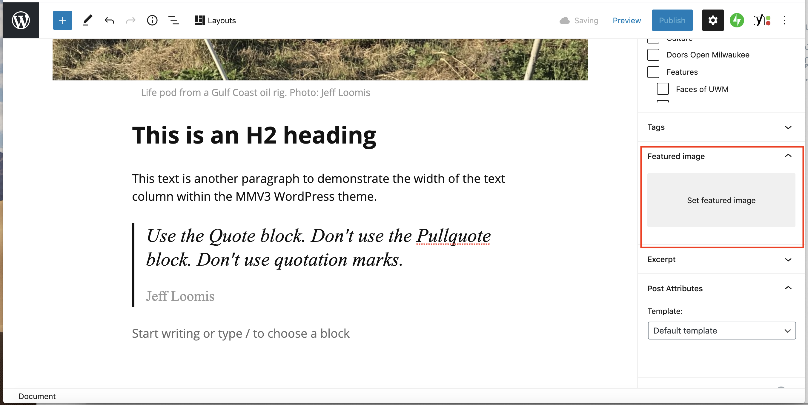

# Setting a Featured Image

A **Featured Image** is the image that appears in a home page card (**Top Stories**, **Headlines**, etc.) or special project grid card. When using the **Advanced** **template**, the **Featured Image** is also the hero image (large image on top of the story.)

A **Featured Image** must be a landscape-oriented image. Minimum dimensions are 1024 x 768 pixels. If you take a photo with a modern phone or camera, the photo will meet (or exceed) these dimensions. Screenshots and photos downloaded from websites will not meet the minimum dimensions.&#x20;

**Note**: Refrain from resizing or cropping images prior to upload.&#x20;

1. In a post, make sure the **Document** tab is selected (on right.)
2. Scroll down to the **Featured Image** area (on right.)
3. Click **Set featured image.**
4. In the **Featured Image** box, use the **Upload** tab to navigate to and select an image on your computer. Or, use the **Media Library** tab to select an image that was previously added to the site.
5. Click **Set featured image**.

