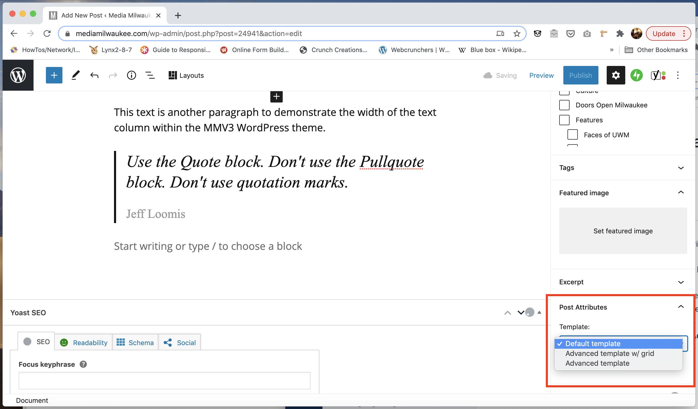

# Switching Between Default and Advanced Post Template

The **Default template** is for standard-length stories like [this](https://mediamilwaukee.com/news/milwaukee-protest-march).

The **Advanced template** is for long-form stories like [this](https://mkemidterms.mediamilwaukee.com/passion-for-justice-safety-energizes-milwaukee-jewish-vote-after-pittsburgh-massacre/).

1. In a post, make sure the **Document** tab is selected.
2. In the **Document** tab area, scroll down to the **Post Attributes** area (near bottom.)
3. Click the drop-down button in the **Template** area. Choose **Default template** or **Advanced template**. **Note**: Do not choose **Advanced template w/ grid** (this is for creating a grid of existing stories.)


